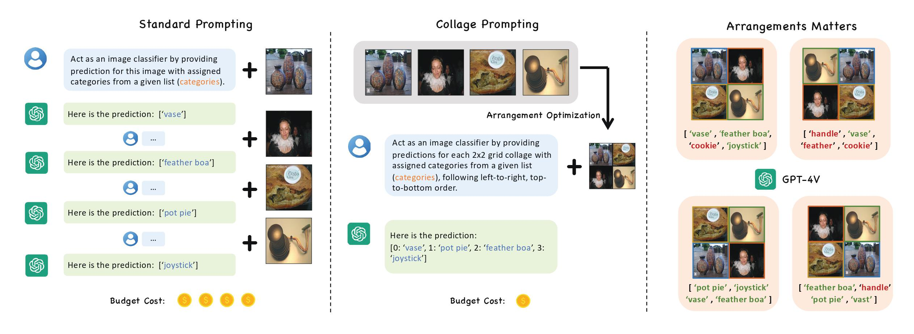

<h1>CollagePrompt
</h1>

<h3>CollagePrompt: A Benchmark for Budget-Friendly Visual Recognition with GPT-4V</h3>

[Siyu Xu](https://siyuxu.com), [Yunke Wang](https://yunke-wang.github.io/), [Daochang Liu](https://daochang.site/), [Bo Du](https://scholar.google.com/citations?hl=en&user=Shy1gnMAAAAJ), [Chang Xu](http://changxu.xyz/)

* [**Overview**](#overview)  
* [**License**](#license)  

## Overview

The CollagePrompt is a benchmark platform designed to address the financial challenges associated with utilizing GPT-4V for visual recognition tasks. By leveraging grid collages of various sizes, this benchmark provides an efficient and cost-effective approach to visual recognition without significantly compromising accuracy. The dataset includes a variety of visual prompts that have been carefully curated to facilitate robust testing and optimization of AI models.

### Dataset Statistics:

- **2x2 Collages:**
  - Training Set: 25,000 collages and 110,250 collage prompts from ImageNet-1K
  - Validation Set: 12,500 collages from ImageNet-1K
- **3x3 Collages:**
  - Training Set: 11,111 collages and 102,646 collages prompts from ImageNet-1K
  - Validation Set: 5,555 collages from ImageNet-1K
- **Additional Validation Sets:** The validation sets also include collages from other common image recognition datasets such as Aircraft, Caltech101, DTD, EuroSAT, Food101, OxfordFlowers, OxfordPets, StanfordCars, SUN397, and UCF101.

### Key Features:

- **Cost Efficiency:** Transitioning from single images to grid collages (e.g., 2x2) significantly reduces inference costs and time while maintaining an acceptable level of accuracy.
- **Grid Size Optimization:** The benchmark highlights the practical value of optimizing arrangements for 2x2 and 3x3 grids, balancing cost and accuracy effectively.
- **Baseline Algorithms:** The dataset has been used to train and evaluate baseline algorithms for optimizing collage prompts, providing a solid foundation for further research and development.

Using the CollagePrompt benchmark, researchers can optimize image arrangements to minimize accuracy loss and reduce costs associated with GPT-4V’s visual recognition tasks.

### Abstract

Recent advancements in generative AI have suggested that by taking visual prompts, GPT-4V can demonstrate significant proficiency in visual recognition tasks. Despite its impressive capabilities, the financial cost associated with GPT-4V's inference presents a substantial barrier to its wide use. To address this challenge, we propose a budget-friendly collage prompting task that collages multiple images into a single visual prompt and makes GPT-4V perform visual recognition on several images simultaneously, thereby reducing the average cost of visual recognition. We present a comprehensive *dataset* of various collage prompts to assess its performance in GPT-4V's visual recognition. Our evaluations reveal several key findings: **1)** Recognition accuracy varies with different positions in the collage. **2)** Grouping images of the same category together leads to better visual recognition results. **3)** Incorrect labels often come from adjacent images. These findings highlight the importance of image arrangement within collage prompt. To this end, we construct a *benchmark* called **CollagePrompt**, which offers a platform for designing collage prompts to achieve more cost-effective visual recognition with GPT-4V. A *baseline* method derived from genetic algorithms to optimize collage layouts is proposed and two *metrics* are introduced to measure the efficiency of the optimized collage prompt. Our benchmark enables researchers to better optimize collage prompts, thus making GPT-4V more cost-effective in visual recognition.

## License  
<!-- #### Code License -->

* This code is released under the [MIT license](LICENSE).
<!-- #### Dataset License -->
* The `CollagePrompt` Dataset is licensed under [CC BY 4.0](https://creativecommons.org/licenses/by/4.0/).

